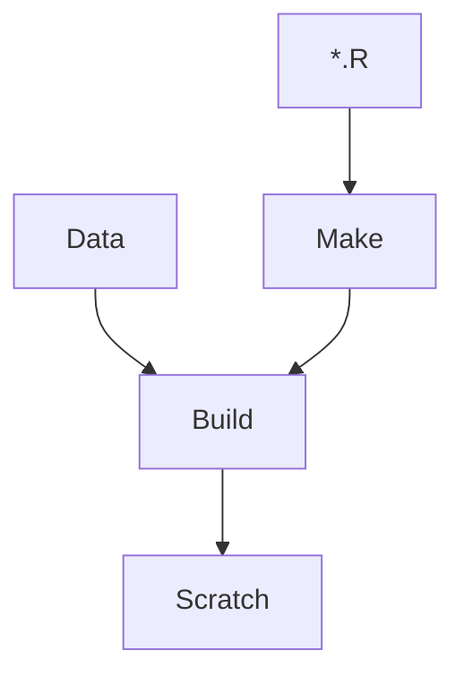

# InMAP-SFAB

[InMAP](https://inmap.run) analyses scoped to the San Francisco air basin ("SFAB").

## Project / Task Management

- We can use GH [issues] liberally.
- There's a modest [project board][project]. We can use this, if it's helpful. Maybe as the project grows, it'll be more helpful.

## Notable Files and Folders

As of 2022-04-25:

- "Demo" inputs (from the UW team) and outputs are in [Data/UW/] and [Build/Demo/], respectively.
- A series of R scripts to "make" intermediate datasets is in [Make/]. These write to subdirectories of [Build/]. 
- R utility functions, written by @dholstius, are in [R/]. These are employed by scripts in [Make/].
- Scripts in [Scratch/] look for stuff in [Build/], and summarize it in human-friendly ways.
- GIS definitions are exported to [Build/Geodata/].
- Hardened scratch-work will most likely be promoted to `Analyses/` or `Report/`.

[issues]: https://github.com/BAAQMD/InMAP-SFAB/issues
[project]: https://github.com/orgs/BAAQMD/projects/7/views/4
[Data/UW/]: ../../tree/master/Data/UW
[Build/]: ../../tree/master/Build
[Build/Geodata/]: ../../tree/master/Build/Geodata
[R/]: ../../tree/master/R
[Make/]: ../../tree/master/Make
[Scratch/]: ../../tree/master/Scratch
