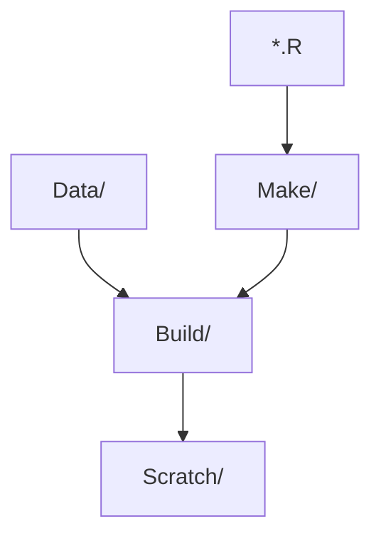

# InMAP-SFAB

- :tada: Scope: [InMAP](https://inmap.run) analyses scoped to the San Francisco air basin ("SFAB").

## Project / Task Management

- We can use GH [issues] liberally.
- There's a modest [project board][project]. We can use this, if it's helpful. Maybe as the project grows, it'll be more helpful.

## Notable Files and Folders

As of 2022-05-04:

- A series of R scripts to "make" intermediate datasets is in [Make/]. 
    - The scripts are numbered `100-setup.R`, `200-import.R`, etc., and may source sub-scripts.
    - They write to subdirectories of [Build/]. For example:
        - GIS definitions are exported to [Build/Geodata/].
        - Scratch work related to the "demo" handoff is exported to [Build/Demo/].
    - They take input from subdirectories of [Data/], which has its own [README](./Data/README.md). 
    - They make use of utility functions found in [R/].
- Scripts in [Scratch/] look for stuff in [Build/], and summarize it in human-friendly ways.
- "Demo" inputs (from the UW team) and outputs are in [Data/UW/] and [Build/Demo/], respectively.
- Hardened scratch-work will most likely be promoted at a later date to `Analyses/` or `Report/`.

[issues]: https://github.com/BAAQMD/InMAP-SFAB/issues
[project]: https://github.com/orgs/BAAQMD/projects/7/views/4
[Data/UW/]: ../../tree/master/Data/UW
[Build/]: ../../tree/master/Build
[Build/Geodata/]: ../../tree/master/Build/Geodata
[Build/Demo/]: ../../tree/master/Build/Demo
[R/]: ../../tree/master/R
[Make/]: ../../tree/master/Make
[Scratch/]: ../../tree/master/Scratch
